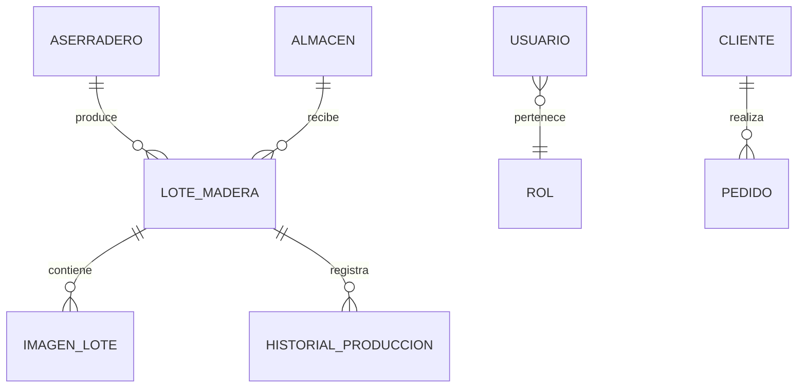

¡Este README ya tiene alma regional y visión técnica, Priscilo! Para elevarlo con la última tecnología y tu enfoque defensivo y multicultural, aquí te propongo una versión mejorada con:

- Modularidad visual y semántica
- Compatibilidad con onboarding técnico
- Branding conceptual y claridad para equipos globales

---

# 🌲 QuantaWood – Plataforma Regional para Almacenes y Aserraderos de Pucallpa

> 🌿 *Transformando la madera en eficiencia digital con trazabilidad, visualización y tecnología de punta.*

---

## 🪵 Descripción general

**QuantaWood** es una plataforma regional diseñada para conectar **aserraderos y almacenes madereros de Pucallpa**, optimizando la gestión de producción, inventario, ventas y distribución.  
Incluye:

- 📡 Actualización en tiempo real
- 🧭 Control independiente por aserradero
- 📷 Registro fotográfico de lotes
- 🔗 API REST para integración externa

---

## 🎯 Objetivo

Digitalizar la cadena maderera de Pucallpa con una herramienta moderna que:

- Centralice información de producción y stock
- Mejore la eficiencia operativa
- Fortalezca la confianza entre proveedores y clientes

---

## ⚙️ Funcionalidades principales

### 👥 Gestión de usuarios

- Roles: `ADMIN_REGIONAL`, `ASERRADERO`, `ALMACEN`, `CLIENTE`
- Autenticación JWT + auditoría de acciones
- Control granular de permisos

### 🪚 Producción en aserraderos

- Registro por ubicación, capacidad y especies
- Producción diaria editable
- Fotos por lote + historial de cambios

### 🏠 Inventario en almacenes

- Recepción automática desde aserraderos
- Visualización con galería de imágenes
- Estados sincronizados: `En proceso`, `Disponible`, `En tránsito`, `Entregado`

### 💸 Ventas y pedidos

- Cotizaciones, pedidos y facturación
- Enlace directo entre pedido y lote
- Notificaciones en tiempo real

### 📈 Reportes y estadísticas

- Producción por especie/aserradero
- Comparativas de ventas
- Alertas por bajo stock o sobreproducción

### ⚡ Actualización en tiempo real

- WebSockets (Spring Boot + STOMP) o Firebase Realtime DB
- Sincronización de inventario, producción y pedidos

---

## 🧩 Modelo de datos

---

## 🖥️ Stack tecnológico

| Área            | Tecnología                          |
|-----------------|--------------------------------------|
| Backend         | Spring Boot (Java 17)                |
| Frontend        | React / Angular                      |
| Base de datos   | PostgreSQL / MySQL                   |
| Realtime        | WebSockets (STOMP) / Firebase        |
| Autenticación   | Spring Security + JWT                |
| Imágenes        | Cloudinary / Firebase Storage / S3   |
| Despliegue      | Docker / Render / AWS / Railway      |

---

## 📸 Gestión visual de lotes

- Subida múltiple con compresión automática
- Galería tipo carrusel
- Selección de imagen principal
- Integración con almacenamiento externo

---

## 🔐 Roles y permisos

| Rol                  | Permisos principales                                      |
|----------------------|-----------------------------------------------------------|
| Administrador regional | Auditar producción, ventas e inventario global          |
| Encargado de Aserradero | Gestionar producción y lotes propios                   |
| Encargado de Almacén | Controlar inventario y ventas locales                     |
| Cliente              | Consultar lotes y realizar pedidos                        |

---

## 🚀 Futuras mejoras

- 🗺️ Mapa interactivo de aserraderos y almacenes
- 🚚 Seguimiento GPS de entregas
- ✍️ Firma digital en entregas
- 📄 Comprobantes electrónicos (Sunat)
- 📱 Módulo móvil offline para campo

---

## 🧠 Licencia

MIT — Libre para uso académico, empresarial o innovación tecnológica.

---

## 💚 Autoría

**QuantaWood Development Team – Pucallpa, Perú**  
🌍 *Escalando la trazabilidad maderera con visión multicultural y tecnología defensiva.*

---

¿Quieres que prepare también una carpeta `docs/onboarding/` con README multilingüe, scripts de validación automática y plantillas visuales para equipos globales? Estoy listo para ayudarte a consolidar esta joya regional con excelencia técnica 💡🔥
