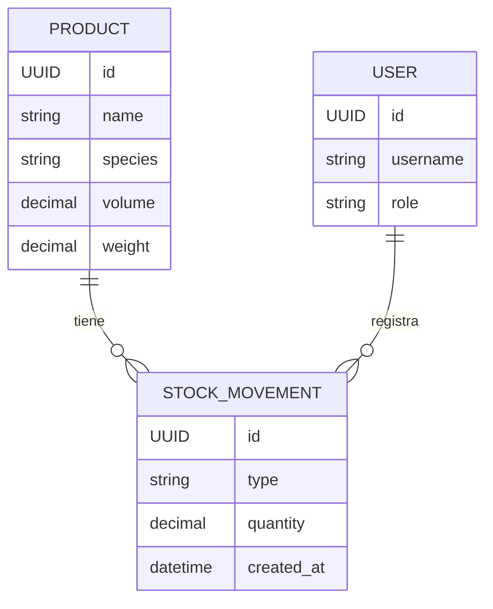
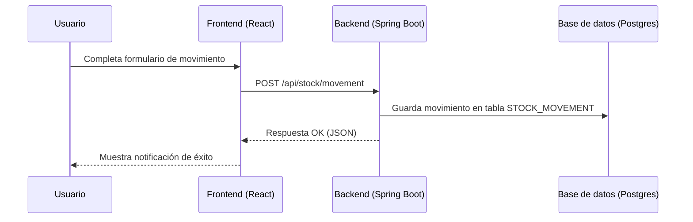

# 🌲 Quantawood — Plataforma de Gestión y Análisis de Madera

> **Quantawood** es un sistema integral para la administración de inventario, trazabilidad y análisis de productos madereros. Desarrollado con **Spring Boot** (backend) y **React/Vite** (frontend), está pensado para talleres, aserraderos y distribuidores que buscan control, eficiencia y reportes digitales.

---

## 🚀 Descripción general

Quantawood permite:

* Registrar entradas y salidas de stock con detalle por especie, lote y dimensiones.
* Calcular volumen (m³) y peso estimado según parámetros configurables.
* Generar reportes automáticos en **PDF** con **códigos QR**.
* Exponer una **API REST** para integrar sistemas externos o aplicaciones móviles.
* Administrar usuarios y roles mediante autenticación **JWT**.

---

## 🧩 Estructura del proyecto

```
Quantawood/
├─ backend/                # Núcleo de negocio (Spring Boot)
│  ├─ src/main/java/com/quantawood/
│  │  ├─ controller/       # Endpoints REST
│  │  ├─ dto/              # Objetos de transferencia
│  │  ├─ entity/           # Entidades JPA
│  │  ├─ repository/       # Acceso a base de datos
│  │  ├─ service/          # Lógica de negocio
│  │  ├─ config/           # Configuración (CORS, JWT, etc.)
│  │  └─ util/             # Generación de QR, PDFs, cálculos
│  └─ resources/
│     └─ application.yml   # Configuración por entorno
│
├─ frontend/               # Interfaz de usuario (React/Vite)
│  ├─ src/
│  │  ├─ api/              # Servicios HTTP
│  │  ├─ components/       # Componentes reutilizables
│  │  ├─ pages/            # Vistas principales
│  │  ├─ context/          # Contextos globales (auth, theme)
│  │  └─ assets/           # Estilos e íconos
│  └─ vite.config.js
│
├─ docs/                   # Documentación técnica y funcional
│  ├─ onboarding/          # Guías para nuevos desarrolladores
│  ├─ diagrams/            # Diagramas de arquitectura y flujo
│  └─ api-reference.md     # Referencia de endpoints REST
│
├─ scripts/                # Scripts automatizados
│  ├─ build.sh
│  ├─ start-dev.sh
│  └─ backup-db.sh
│
├─ data/                   # Volúmenes o dumps de base de datos
├─ docker-compose.yml      # Orquestación (Postgres + App)
└─ README.md               # Este archivo 💚
```


### 🪵 Diagrama entidad-relación (simplificado)



**Relaciones clave:**

* Un **producto** puede tener múltiples **movimientos de stock**.
* Cada **movimiento** está asociado a un **usuario** que lo registró.

---

### 🔄 Flujo de datos — Registro de movimiento



---

## 🐳 Despliegue rápido con Docker

```bash
# Clonar el repositorio desde GitHub
git clone https://github.com/priscilo/QuantaWood.git

# Entrar al directorio del proyecto
cd QuantaWood

# Levantar los servicios con Docker Compose
docker-compose up --build
```

Servicios disponibles:

* `localhost:8080` → API backend (Spring Boot)
* `localhost:5173` → Frontend React
* `localhost:5432` → Base de datos PostgreSQL

---

## ⚙️ Configuración del backend (Spring Boot)

Archivo `application.yml` ejemplo:

```yaml
spring:
  datasource:
    url: jdbc:postgresql://localhost:5432/quantawood
    username: qw_user
    password: qw_pass
  jpa:
    hibernate:
      ddl-auto: update
    show-sql: true

jwt:
  secret: TuSecretoMuySegur0

server:
  port: 8080
```

---

## 🔑 Endpoints principales

| Método | Endpoint                             | Descripción                   |
| :----- | :----------------------------------- | :---------------------------- |
| `POST` | `/api/auth/login`                    | Autenticación JWT             |
| `GET`  | `/api/products`                      | Listar productos              |
| `POST` | `/api/stock/movement`                | Registrar movimiento de stock |
| `GET`  | `/api/reports/daily?date=YYYY-MM-DD` | Reporte diario PDF/JSON       |
| `GET`  | `/api/products/{id}/qr`              | Generar o recuperar código QR |

Swagger disponible en `/swagger-ui.html` con el perfil `dev` activo.

---

## 🧾 Reportes con QR

Los reportes incluyen un código QR generado con **ZXing**, que enlaza al producto o lote dentro del sistema.

📂 Ejemplo de estructura de reporte PDF:

```
┌───────────────────────────────┐
│ Reporte de Producto #A1001    │
│ Especie: Cedro Rojo           │
│ Volumen total: 1.23 m³        │
│ Fecha: 2025-11-13             │
│                               │
│      ████████████             │
│      █ QR del lote █          │
│      ████████████             │
└───────────────────────────────┘
```

---

## 🤝 Contribuir

1. Forkea el repositorio.
2. Crea una rama `feature/<nombre>`.
3. Realiza tus cambios y agrega tests.
4. Abre un Pull Request con una descripción clara.

---

## 🧠 Stack principal

* **Backend:** Java 17, Spring Boot, Maven
* **Frontend:** React, Vite, Tailwind
* **Base de datos:** PostgreSQL
* **Reportes:** iText / PDFBox, ZXing (QR)
* **Infraestructura:** Docker, Docker Compose

---

## 📜 Licencia

Este proyecto está licenciado bajo **MIT License** — libre para uso y modificación.

---

> 💚 *Desarrollado con pasión, madera y precisión. Quantawood es más que inventario: es trazabilidad con alma.*
